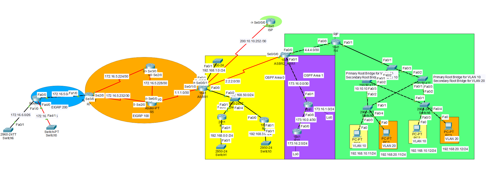

# 🌐 Enterprise Network Design (Packet Tracer)

This project demonstrates the configuration of a multi-protocol enterprise network using Cisco Packet Tracer.

The network includes routing, switching, VLANs, DHCP, and spanning tree configurations.

---

## 🖼️ Network Topology

---

## 🎯 Objectives

1. Configure the full network topology  
2. Configure multi-area OSPF:
   - R2 as DR (Designated Router)
   - R3 as BDR (Backup Designated Router)
3. Summarize Area 1 at ABR1  
4. Configure EIGRP:
   - Ensure R5 → R6 is the successor path to reach `172.16.5.224/30`
5. Configure DHCP on R4 for:
   - VLAN 10
   - VLAN 20
6. Configure STP:
   - Set primary and secondary root bridges as specified  

---

## ⚙️ Technologies Used

- OSPF (Multi-Area)
- EIGRP
- VLANs
- DHCP
- STP (Spanning Tree Protocol)
- Inter-VLAN Routing

---

## 🧠 Key Concepts Demonstrated

- Designated Router (DR) and Backup DR election
- Route summarization in OSPF
- EIGRP metric manipulation (successor path control)
- VLAN segmentation and trunking
- DHCP configuration for multiple VLANs
- STP root bridge configuration for load balancing

---

## 📁 Files Included

- `network.pkt` → Packet Tracer file
- `network-topology.png` → Network diagram

---

## ▶️ How to Use

1. Open the `.pkt` file in Cisco Packet Tracer
2. Explore configurations on routers and switches
3. Verify routing tables and connectivity
4. Test VLAN communication and DHCP assignment

---

## 👤 Author

- Hussain Alibrahim

---

## 💡 Notes

This project reflects practical networking skills including routing protocols, switching, and network design.

It is suitable as a demonstration of CCNA-level knowledge and beyond.
